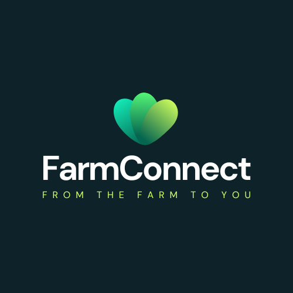

# FarmConnect

## Project Description

FarmConnect is a revolutionary app that connects farmers directly with consumers, creating a streamlined and efficient marketplace for livestock, farm produce, and even farm equipment. With FarmConnect, farmers can easily post their inventory and negotiate directly with buyers, cutting out the middleman and ensuring they get the best possible price for their products.

But that's not all - FarmConnect also provides a platform for third-party sellers to offer their products to farmers, giving them access to the latest in farm equipment, fertilizers, and more. Our app is the ultimate one-stop-shop for all things farming, making it easier than ever to get what you need, when you need it.

And the best part? By connecting farmers and consumers directly, we're helping to create a more sustainable and equitable food system. Farmers can earn a fair price for their products, while consumers can have greater access to fresh, locally-sourced food.

## Getting Started

Since this project will hold both the client application and the server application there will be node modules in two different places. First run `npm install` from the root. After this you will run `npm run-script install-all` from the root. In the **frontend** directory, run `npm run start` and in the backend directory, run `npm run dev`.

## Project structure

### `frontend` - Holds the client application

- #### `public` - This holds all of our static files

- #### `src`

  - `assets` - This folder holds assets such as images, docs, and fonts

  - `components` - This folder holds all of the different components that will make up our views
  - `views` - These represent a unique page on the website i.e. Home or About. These are still normal react components
  - `App.js` - This is what renders all of our browser routes and different views
  - `index.js` - This is what renders the react app by rendering App.js, should not change

### `backend` - Holds the server application

- #### `config` - This holds our configuration files, like mongoDB uri

- #### `controllers` - These hold all of the callback functions that each route will call

- #### `models` - This holds all of our data models

- #### `routes` - This holds all of our HTTP to URL path associations for each unique url

- #### `middleware` - This holds our middleware functionality such as error handling

- #### `server.js` - Connects the server to the database

## Inspiration

FarmConnect was inspired by my passion in agribusiness and technology. Through research, I discovered that Kenyan farmers face several challenges when selling their harvest. Some of these challenges include:

- **Limited Market access**: Small-scale farmers in Kenya lack access to markets where they can sell their produce at a fair price. This is due to poor infrastructure such as roads, lack of proper storage facilities and limited access to information about market prices.
- **Exploitative pricing**: Middlemen and brokers often take advantage of farmers' limited bargaining power to offer very low prices for their produce, while selling at much higher prices in urban markets.
- **Lack of transparency**: Middlemen and brokers may not provide transparent information to farmers about the true market value of their produce, or they may conceal information about the quality and quantity of the produce to secure lower prices.

## How does FarmConnect address these issues?

FarmConnect is a real-world solution that seeks to address the issues affecting Kenyan farmers as described below:

- **Limited Market access**: FarmConnect provides a platform where farmers are exposed to consumers resulting in a much better bargaining position regardless of the production scale. Farmers are able to set up fair prices based on market trends.
- **Exploitative pricing**: FarmConnect eliminates the need for middlemen and brokers by enabling farmers and consumers to interact directly on one platform.
- **Lack of transparency**: With FarmConnect, farmers are  always informed about the true market value of their produce.
- **Inefficient supply chains**: FarmConnect provides necessary logistics to transport produce(orders) efficiently to the consumer without compromising on product quality.

## Architecture

### Backend

On the server-side, FarmConnect uses Node.js and Express.js to build a robust and scalable server that handles all of the application's business logic. Express.js simplifies the process of building web applications by providing a set of tools and utilities for handling HTTP requests, routing, and middleware. MongoDB was most suitable for this application because of its scalability, flexibility, performance, availability and integration capabilities.Redux is used as a centralized state manager to manage and coordinate data changes across different components.

### Frontend

On the client-side, FarmConnect is built using React, which is a popular front-end JavaScript library that allows for the creation of dynamic user interfaces. React is responsible for rendering the user interface of the application and handling user interactions. It also communicates with the server-side to retrieve data from the database and display it to the user.

## Screenshots

